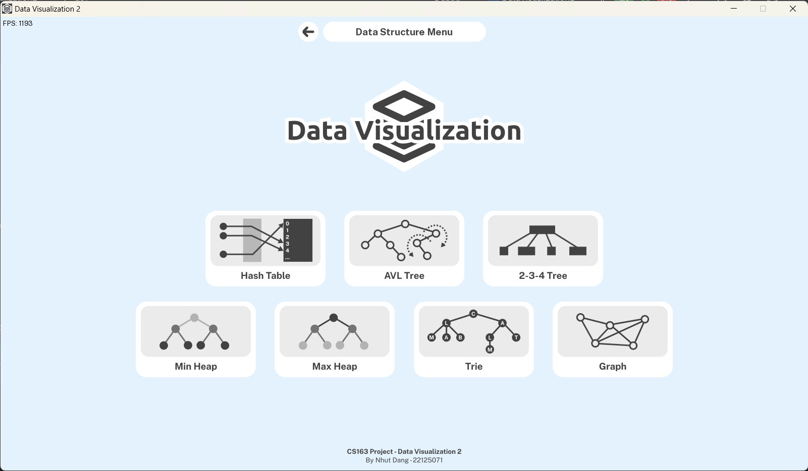

# Data Visualization 2
This is my solo project for the course CS163 of HCMUS's APCS. The application can visualize hash table, binary tree, 
AVL tree, 2-3 tree, 2-3-4 tree, heap, trie, and graph.

## External Libraries
- [SFML](https://github.com/SFML/SFML) library for graphic display.
- [portable-file-dialogs](https://github.com/samhocevar/portable-file-dialogs) by samhocevar for file dialogs calling.

## Screenshots

## Features

### Main Features
- [x] Main menu
- [x] Option menu
- [x] Settings 
- [x] About page
- [x] Themes
  - [x] Light theme
  - [x] Dark theme
- [ ] Code highlight
  - [x] Hash table
  - [ ] AVL tree
  - [ ] 2-3-4 tree
  - [x] Min/Max MaxHeap
  - [ ] Trie
  - [ ] Graph

### Data structures

- [ ] Hash table
  - [x] Create
  - [x] Insert
  - [ ] Delete
  - [x] Search
- [ ] AVL tree
  - [ ] Create
  - [ ] Insert
  - [ ] Update
  - [ ] Delete
  - [ ] Search
- [ ] 2-3-4 tree
  - [ ] Create
  - [ ] Insert
  - [ ] Update
  - [ ] Delete
  - [ ] Search
- [x] Min/Max MaxHeap
  - [x] Create
  - [x] Push
  - [x] Delete
  - [x] Top
  - [x] Size
- [ ] Trie
  - [ ] Create
  - [ ] Insert
  - [ ] Delete
  - [ ] Search
- [ ] Graph
  - [ ] Create (from a matrix)
  - [ ] Connected components
  - [ ] Minimum spanning tree
  - [ ] Dijkstra

## Documentation
Overleaf: https://www.overleaf.com/read/gfbrjjnzgkbm

